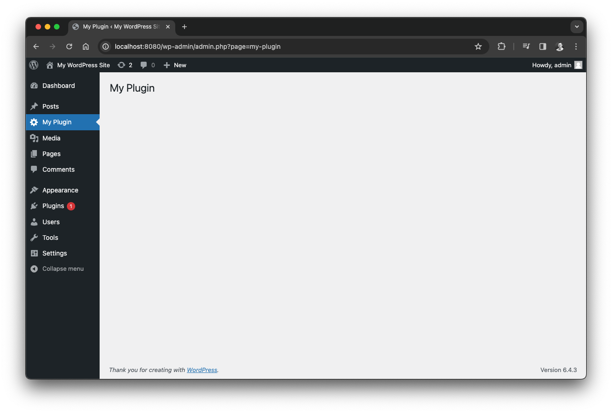
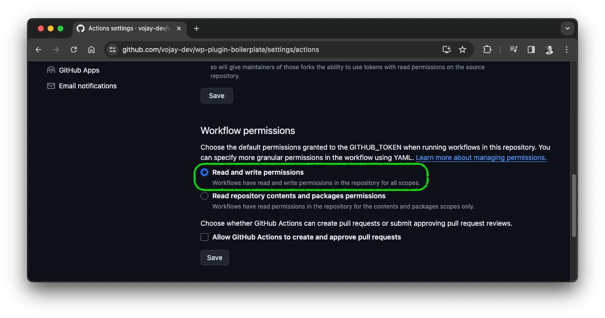
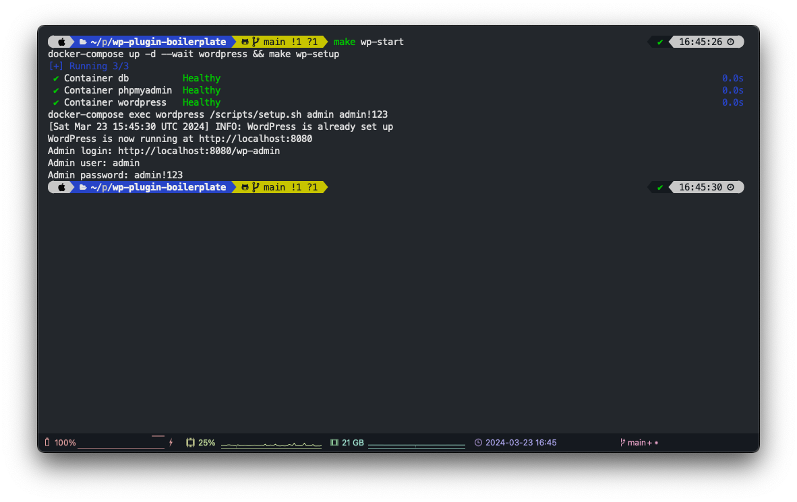
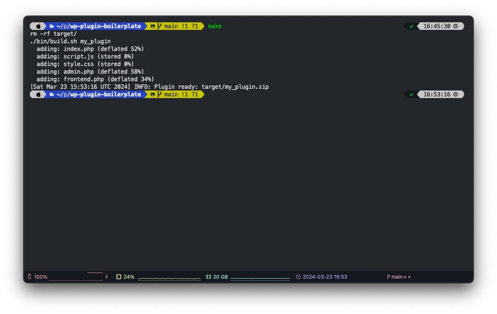
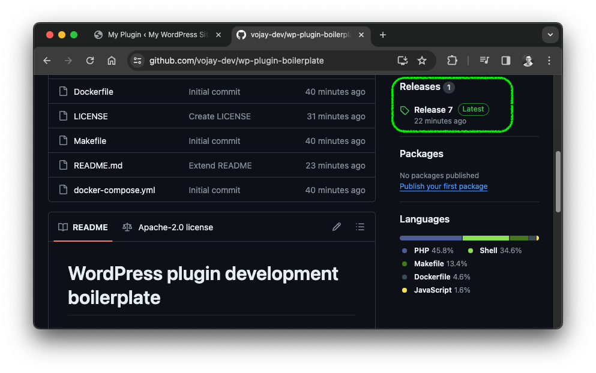
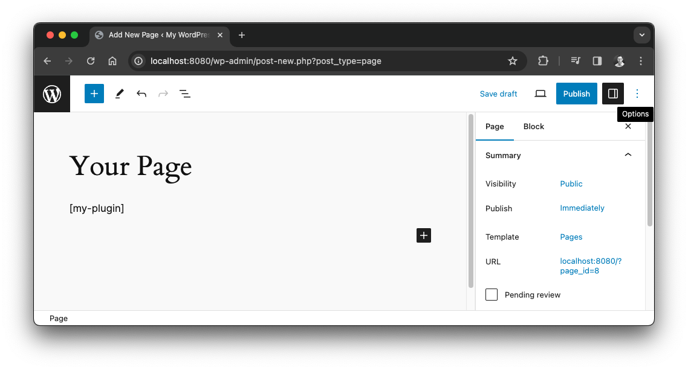
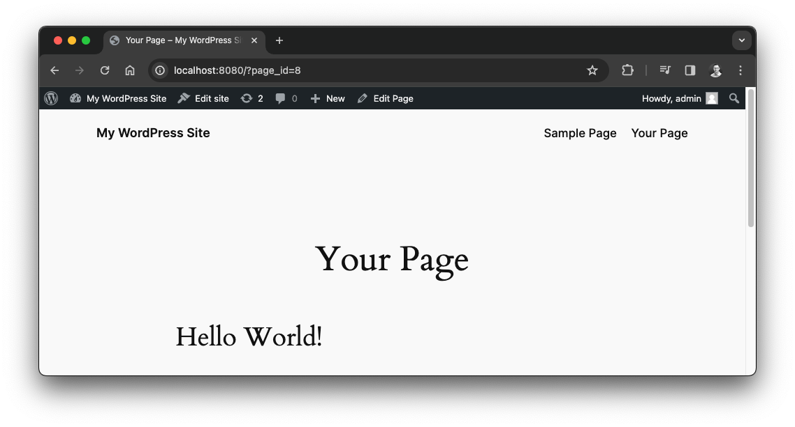

# WordPress plugin development boilerplate


This project is a WordPress plugin development boilerplate to jumpstart WordPress plugin projects. It utilizes Docker for a local environment and includes an automated setup of WordPress with a configurable admin user and password.



With the boilerplate you get a simple template to get started with a plugin that includes a dedicated **admin page** as well as an example **shortcode to be rendered on any page**.

Furthermore it includes a build script and Github Workflow to generate an installable plugin release.

* Docker
* Linux, macOS

Simply create a fork of this repo and get started by implementing your plugin in an efficient environment.

## Setup

* Fork the project
* Adjust the plugin name in `.env`
* Enable access to the `GITHUB_TOKEN` for the Github workflow to create releases: `Repository settings` -> `Actions` -> `General` -> `Workflow permission` -> select `Read and write permissions`.



Commands to interact with Docker as well as building the plugin are encapsulated in the `Makefile`.

## Start local WordPress via Docker
```sh
make wp-start
```

This starts a local WordPress and database container. It uses the latest WordPress version and installs the WordPress CLI to automatically setup an admin user with the configured user and password in `.env`. After the setup is complete, you will get details on how to access WordPress in the log output.



After starting the Docker setup, you can reach WordPress locally via:

* Frontend: http://localhost:8080
* Backend: http://localhost:8080/wp-admin

Your plugin is already installed automatically and can be activated!


## Stop local WordPress via Docker
```sh
make wp-stop
```

## Build plugin
```sh
make
```

This command will trigger the `bin/build.sh` script with the configured plugin name in `.env` to create an installable WordPress plugin `.zip` file.



Also the Github workflow in `.github/workflows/build.yml` will automatically build the plugin and create a release with the `.zip` file on any push to `main`.



## Plugin development

The source of your plugin is in `src/`. There are already examples added, to get started quickly:

* `src/index.php`: General setup and global variables / functions
* `src/admin.php`: Admin page
* `src/frontend.php`: Code to render the custom shortcode
* `src/script.js`: Custom JS code loaded with your plugin
* `src/style.css`: Custom CSS code loaded with your plugin

With the given example, you will get a custom admin page and a shortcode `[my-plugin]` that will be rendered with a "Hello World!" example.




From here, you can get started with your plugin within an efficient local environment including a build workflow.

> If you use this boilerplate, feel free to star ⭐️ this repo and add your project to this README. Knowledge shared is knowledge squared!
